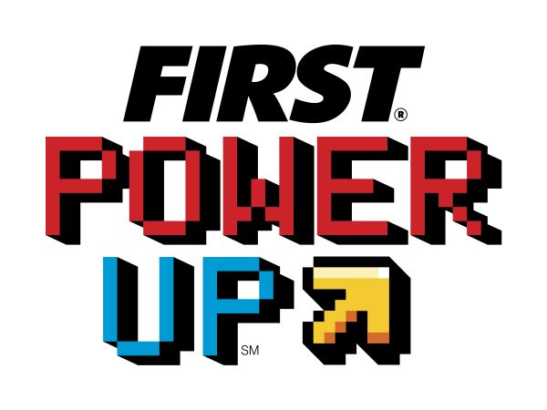

# FRC 2018
The Pigmice's code for FIRST Power Up

## Installation
1. Clone this repo. `git clone https://github.com/Pigmice2733/frc-2018.git`
2. Install python3 and pip3. Get these from your OS's package manager.
3. Install pipenv: `pip3 install pipenv`
4. Run `pipenv install` in this directory to download and install the dependencies
5. Whenever you want to work on this project, run `pipenv shell` to configure python to use these dependencies

## Deployment
1. Connect to the robot
2. Run `./robot.py deploy` (Linux/Mac), or `py -3 robot.py deploy` (Windows)

## Running Tests
1. Run `./robot.py test` (Linux/Mac), or `py -3 robot.py test` (Windows)

## Running the Simulator
1. Run `./robot.py sim` (Linux/Mac), or `py -3 robot.py sim` (Windows)
